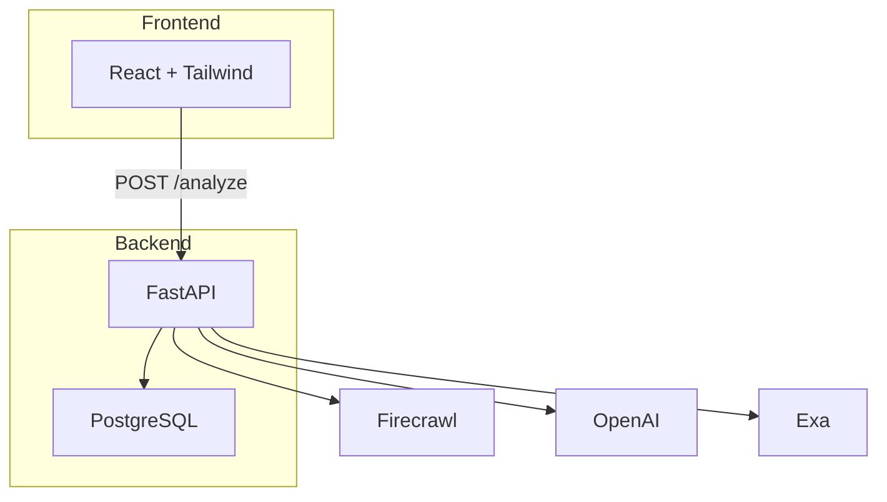

# StoryLens — 2-minute pitch

Quick-reference for presenting the demo. Diagrams are Mermaid - they render directly in GitHub,
Cursor, and most markdown viewers. Screenshot them into slides if you need static images.

---

## The one-liner

> **Paste any news article. Get a Trust Score you can actually audit — not a black-box "AI verdict."**

## The hook (10 seconds)

Everyone's drowning in news and nobody knows what to believe. Existing "fact-checkers" either give
you a vague AI vibe-check, or a binary "true/false" that oversimplifies everything. Neither shows
its work.

## The solution (15 seconds)

**StoryLens** reads an article, extracts its key claims, searches the web for how *other*
independent outlets cover the same story, and computes a **0-100 Trust Score** — with a plain
Python formula, not an LLM guess. Every number on screen traces back to a visible reason.

---

## Live demo script (60 seconds)

1. Paste this URL (pre-cached, loads instantly for the demo):
   ```
   https://www.theguardian.com/business/2026/sep/09/oil-prices-rise-iran-war-brent-crude-inflation-higher-interest-rates
   ```
2. Point at the **Trust Score gauge** (78/100) — "not a yes/no, a calibrated signal."
3. Drag a **weight slider** — score recomputes live. "You decide what matters, not us."
4. Scroll to **claims list** — "every claim individually checked against independent sources:
   supported, contradicted, or unverified."
5. Scroll to **outlet framing** — "here's how three other outlets covered the exact same event."
6. Click **Listen to summary** (if ElevenLabs configured) — 30-second audio recap.

---

## How it works (show this diagram)


**The one thing to say out loud:** *"The LLM never picks the final score — it only produces raw
signals. A plain Python function combines them. That's the difference between a black box and
something you can actually trust."*

---

## Why it's different

| | Typical "AI fact-checker" | StoryLens |
|---|---|---|
| Final verdict | LLM outputs a score directly | Deterministic Python formula |
| Corroboration | Ignored or single-source | Clusters *independent* outlets, filters out wire-copy duplicates |
| Claims | One blob verdict | Per-claim evidence, individually scored |
| Framing | N/A | Side-by-side "how other outlets cover this" |
| Honesty | Implies certainty | Every score has a visible "why" + explicit "unverified" bucket |

---

## Tech stack (if asked)



Deployed on **Render** (backend + Postgres) and **Netlify** (frontend). No Docker, no
Kubernetes — deliberately simple.

---

## Closing line

> *"StoryLens doesn't tell you what to believe. It shows you the receipts — so you can decide for
> yourself."*
