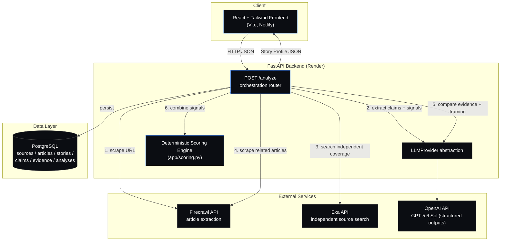

# Architecture

High-level system architecture for StoryLens.

## Key design decisions

- **The LLM never outputs the final Trust Score.** It only produces sub-signals
  (headline consistency, sensationalism, per-claim verdicts + confidence, bias
  label). `app/scoring.py` is plain, deterministic Python that combines those
  signals with source-reputation priors using a transparent, configurable
  weighted formula.
- **`LLMProvider` is an abstract interface** (`app/services/llm/base.py`) so the
  OpenAI implementation can be swapped for another hosted provider (or a local
  Ollama model later) without touching the rest of the app.
- **No Docker.** Backend runs directly via `uvicorn`, frontend via `npm run dev`
  / static build. Kept deliberately simple.
