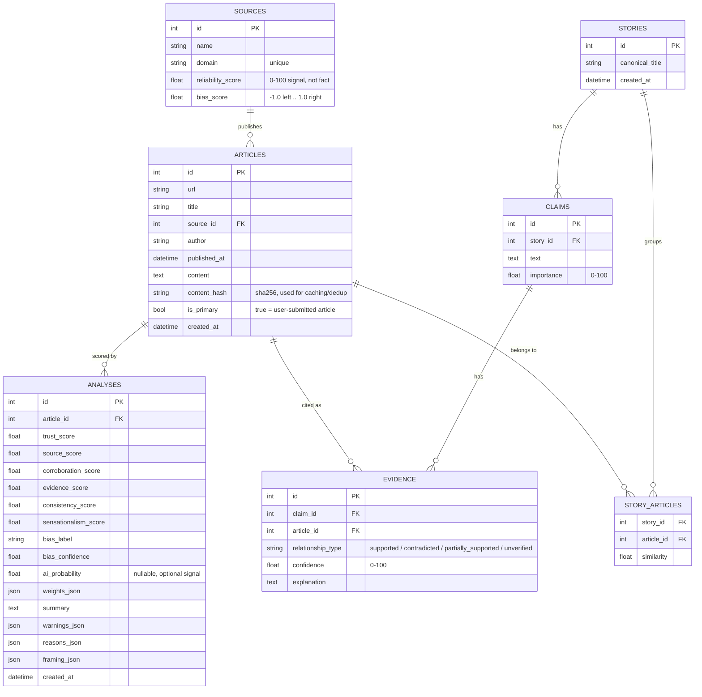

# Database schema

PostgreSQL schema (see `backend/app/models.py`). Tables are created via
`Base.metadata.create_all` on startup - no migration tool.

## Notes

- `sources.reliability_score` / `bias_score` are seeded from a small curated
  table (`app/seed_sources.py`, ~40 well-known outlets) and default to a
  neutral 50 / 0.0 for unknown domains. They are directional signals, not
  facts about the outlet.
- `articles.is_primary` distinguishes the user-submitted article from the
  related/corroborating articles fetched via Exa + Firecrawl for the same
  analysis.
- `articles.content_hash` (sha256 of extracted markdown) is used both to
  detect near-duplicate wire-service content and as the cache key for
  skipping redundant API calls on repeat analyses of the same URL.
- `evidence` rows are only created for articles the LLM actually cited as
  supporting or contradicting a specific claim - not every related article
  gets an evidence row for every claim.
