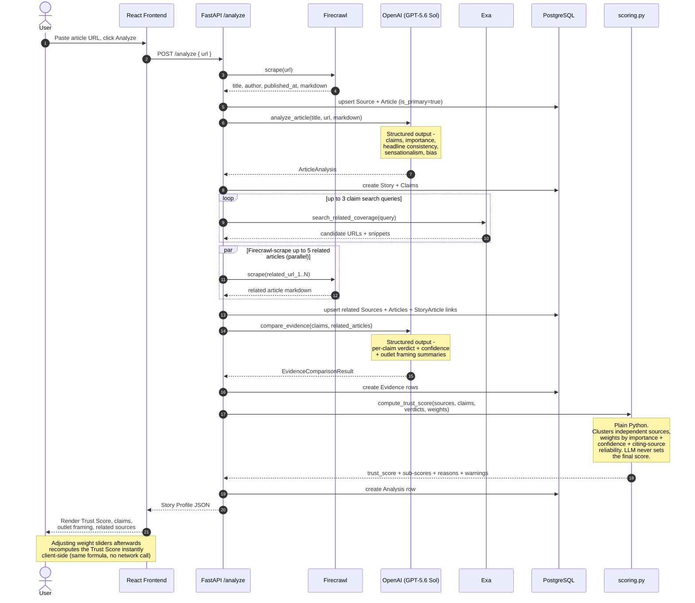

# Request flow: `POST /analyze`

End-to-end sequence for a single article analysis, from URL paste to Story
Profile render.

```mermaid
sequenceDiagram
    autonumber
    actor User
    participant FE as React Frontend
    participant API as FastAPI /analyze
    participant FC as Firecrawl
    participant LLM as OpenAI (GPT-5.6 Sol)
    participant EXA as Exa
    participant DB as PostgreSQL
    participant SCORE as scoring.py

    User->>FE: Paste article URL, click Analyze
    FE->>API: POST /analyze { url }

    API->>FC: scrape(url)
    FC-->>API: title, author, published_at, markdown

    API->>DB: upsert Source + Article (is_primary=true)

    API->>LLM: analyze_article(title, url, markdown)
    Note over LLM: Structured output -<br/>claims, importance,<br/>headline consistency,<br/>sensationalism, bias
    LLM-->>API: ArticleAnalysis

    API->>DB: create Story + Claims

    loop up to 3 claim search queries
        API->>EXA: search_related_coverage(query)
        EXA-->>API: candidate URLs + snippets
    end

    par Firecrawl-scrape up to 5 related articles (parallel)
        API->>FC: scrape(related_url_1..N)
        FC-->>API: related article markdown
    end

    API->>DB: upsert related Sources + Articles + StoryArticle links

    API->>LLM: compare_evidence(claims, related_articles)
    Note over LLM: Structured output -<br/>per-claim verdict + confidence<br/>+ outlet framing summaries
    LLM-->>API: EvidenceComparisonResult

    API->>DB: create Evidence rows

    API->>SCORE: compute_trust_score(sources, claims,<br/>verdicts, weights)
    Note over SCORE: Plain Python.<br/>Clusters independent sources,<br/>weights by importance +<br/>confidence + citing-source<br/>reliability. LLM never sets<br/>the final score.
    SCORE-->>API: trust_score + sub-scores + reasons + warnings

    API->>DB: create Analysis row
    API-->>FE: Story Profile JSON
    FE-->>User: Render Trust Score, claims,<br/>outlet framing, related sources

    Note over User,FE: Adjusting weight sliders afterwards<br/>recomputes the Trust Score instantly<br/>client-side (same formula, no network call)
```
